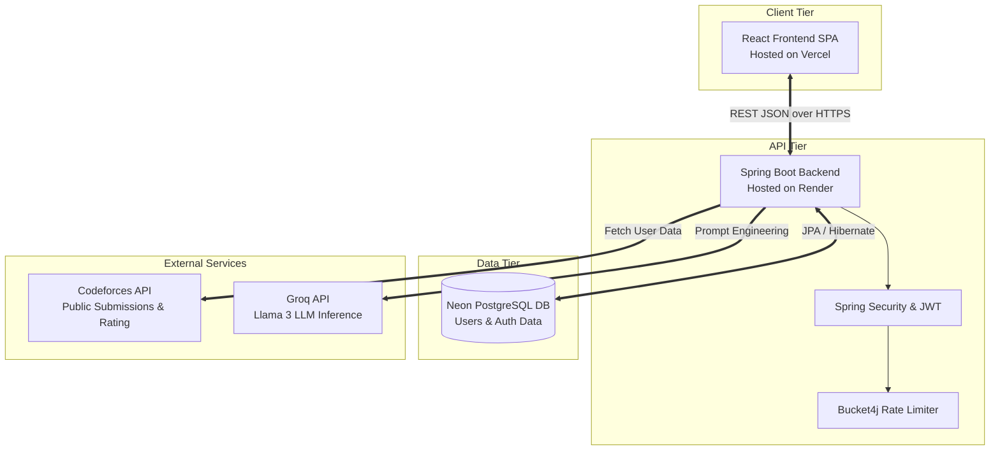
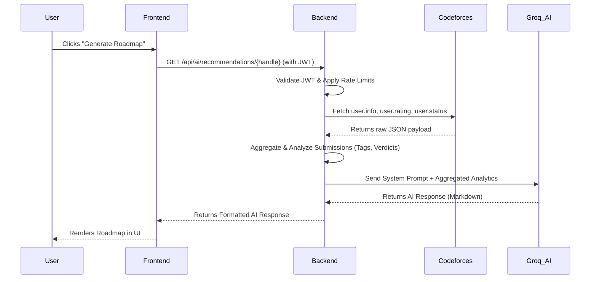

# AIAlgoCoach 🚀

  
  
  
  
  
  
  
  
  

 

  <h2>🌟 Live Demo: <a href="https://ai-algo-coach.vercel.app/" target="_blank">https://ai-algo-coach.vercel.app/</a> 🌟</h2>

AIAlgoCoach is a full-stack AI-powered Competitive Programming Analytics and Mentoring Platform. Inspired by LeetCode, Codeforces visualizers, and premium SaaS dashboards, it provides deep analytics and personalized AI mentorship to accelerate algorithmic problem-solving skills.

---

## 📚 Project Documentation

To dive into the specific codebases, please navigate to the respective documentation files below:

* 🟢 **[Frontend Documentation (React/Vite) ➔](./frontend/README.md)**
* 🔵 **[Backend Documentation (Spring Boot/Java) ➔](./backend/README.md)**
* 🚀 **[Master Setup & Deployment Guide ➔](./HELP.md)**

---

## 🚀 Capabilities & Analysis Engine

AIAlgoCoach fetches raw data from Codeforces and performs complex data aggregation and analysis to provide actionable insights. 

### 📊 Deep Analytics & Data Processing
- **Rating Progression Analysis:** Visualizes the user's Codeforces rating history over time, plotting rank changes dynamically.
- **Topic Mastery & Tag Analysis:** Aggregates thousands of submissions, groups them by algorithmic tags (e.g., DP, Graphs, Math, Greedy), and displays mastery using dynamic radar and bar charts.
- **Difficulty Distribution:** Breaks down solved problems by Codeforces rating tiers (Easy, Medium, Hard) to help users identify their comfort zones.
- **Activity Heatmap:** A GitHub-style contribution graph mapping daily submission frequency over the past year.
- **Verdict Distribution:** Analyzes error trends (Accepted, Wrong Answer, Time Limit Exceeded, Memory Limit Exceeded) to help identify debugging weaknesses.
- **Language Preferences:** Smart-grouping of programming languages (e.g., standardizing `GNU C11` and `Clang++20` under `C++`) to show the user's primary languages.

### 🧠 AI Mentorship Engine
- **Automated Roadmaps:** Leverages **Groq's Llama 3** model (specifically `llama-3.1-8b-instant`) to generate personalized practice strategies by analyzing the user's weakest topics and recent verdicts.
- **Context-Aware Chat:** Engage with an interactive AI mentor. The system injects the user's live Codeforces analytics into the AI's system prompt, giving it complete context about the user's skill level and current struggles.

### 🔒 Enterprise-Grade Security
- **Stateless Authentication:** JWT-based stateless architecture.
- **Rate Limiting:** Dynamic API quotas via Bucket4j protect AI endpoints from abuse.
- **Anti-Brute Force:** Strict IP-based lockouts protecting authentication endpoints.
- **Hardened Validation:** Custom backend field validation and strict XSS sanitization.

---

## 🏗️ Architecture Diagrams

AIAlgoCoach uses a **Decoupled Deployment Architecture**. 
- The React frontend is independently deployed on **Vercel**.
- The Spring Boot backend runs as a Dockerized Web Service on **Render**.
- Data is stored in a managed **Neon PostgreSQL** database.

### System Architecture

### AI Workflow Execution Flow

---

## 🚀 Deployment & Getting Started

If you are a developer looking to build, test, or deploy this application, please refer to the primary setup guide:

👉 **[Read the Master Setup & Deployment Guide (HELP.md)](./HELP.md)**

---

## 👨‍💻 About the Developer

**VAJJHA SAI KRISHNA**  
*Computer Science Engineering Student & Aspiring Java Full Stack Developer with AI Integration*

Passionate about developing futuristic AI assistants, scalable software systems, and modern full-stack applications using professional software engineering principles. Focused on building scalable AI-powered full-stack applications and futuristic intelligent systems.

- **Current Focus:** Full Stack Java Development, AI Engineering, Spring Boot Microservices, React Development, and Intelligent AI Systems.
- **Skills:** Java, Spring Boot, React, REST APIs, PostgreSQL, JWT Authentication, Docker, AI Integration, Groq API, Vercel, Render, and Data Structures & Algorithms.
