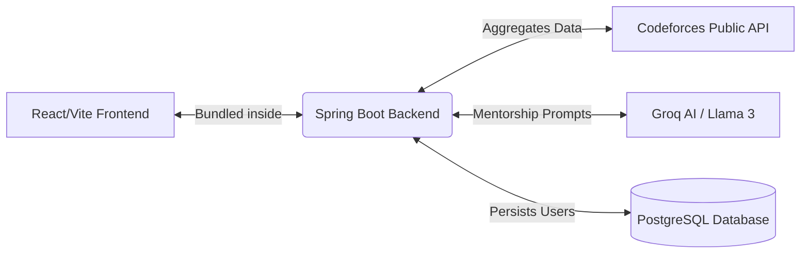

# AIAlgoCoach 🚀

  
  
  
  
  

 

AIAlgoCoach is a full-stack AI-powered Competitive Programming Analytics and Mentoring Platform. Inspired by LeetCode, Codeforces visualizers, and premium SaaS dashboards, it provides deep analytics and personalized AI mentorship to accelerate algorithmic problem-solving skills.

---

## 📚 Project Documentation

To dive into the specific codebases, please navigate to the respective documentation files below:

* 🟢 **[Frontend Documentation (React/Vite) ➔](./frontend/README.md)**
* 🔵 **[Backend Documentation (Spring Boot/Java) ➔](./backend/README.md)**
* 🚀 **[Master Setup & Deployment Guide ➔](./HELP.md)**

---

## 🎯 Project Goals

Built as a strong student developer portfolio project to demonstrate professional software engineering standards:
* Clean GitHub repository
* Proper README
* Good project structure
* Working deployment
* Modern tech stack
* Clear documentation

---

## 🌟 Platform Highlights

### 📊 Comprehensive Dashboard
- **Rating Progression:** Visualize your Codeforces rating history over time.
- **Topic Mastery:** Identify your strengths across core subjects (DP, Graphs, Math) using dynamic radar charts.
- **Difficulty Distribution:** Break down your solved problems by Codeforces rating tiers (Easy, Medium, Hard).
- **Activity Heatmap:** A pixel-perfect, GitHub-style contribution graph mapping your daily submission frequency.

### 📈 Advanced Analytics
- **Global Success Rate:** Track your overall submission acceptance rate.
- **Language Preferences:** Discover your most utilized programming languages with smart-grouping.
- **Verdict Distribution:** Analyze your error trends (WA, TLE, MLE) via interactive bar charts.
- **Comprehensive Tag Mastery:** A deep dive into your top 15 most frequently solved algorithmic tags.

### 🧠 AI Mentorship Engine
- **Automated Roadmaps:** Leverages **Groq's Llama 3 70B** to generate personalized practice strategies by analyzing your weakest topics.
- **Context-Aware Chat:** Engage with an interactive AI mentor that retains your live Codeforces analytics as conversational memory.

---

## 🏗️ Architecture (Monolithic Full-Stack)

AIAlgoCoach uses a highly efficient **Monolithic Deployment Architecture**. While the frontend and backend are developed in separate directories, they are bundled together during the Docker build process so the Spring Boot backend securely serves the React frontend from a single container.

### Components
1. **[Backend API](./backend/README.md):** Java 21 & Spring Boot. Powers the data aggregation engine, Security (JWT/BCrypt), and Spring AI integrations.
2. **[Frontend SPA](./frontend/README.md):** React & Vite. Features a premium glassmorphism aesthetic, responsive Tailwind layouts, and Recharts data visualizations.

---

## 🚀 Deployment & Getting Started

If you are a developer looking to build, test, or deploy this application, please refer to the primary setup guide:

👉 **[Read the Master Setup & Deployment Guide (HELP.md)](./HELP.md)**

---

## 👨‍💻 About the Developer

**VAJJHA SAI KRISHNA**  
*Computer Science Engineering Student & Aspiring Java Full Stack Developer with AI Integration*

Passionate about developing futuristic AI assistants, scalable software systems, and modern full-stack applications using professional software engineering principles. Focused on building scalable AI-powered full-stack applications and futuristic intelligent systems.

- **Current Focus:** Full Stack Java Development, AI Engineering, Spring Boot Microservices, React Development, and Intelligent AI Systems.
- **Skills:** Java, Spring Boot, React, REST APIs, MySQL, JWT Authentication, Microservices, AI Integration, LangChain4j, Gemini API, Groq API, and Data Structures & Algorithms.
